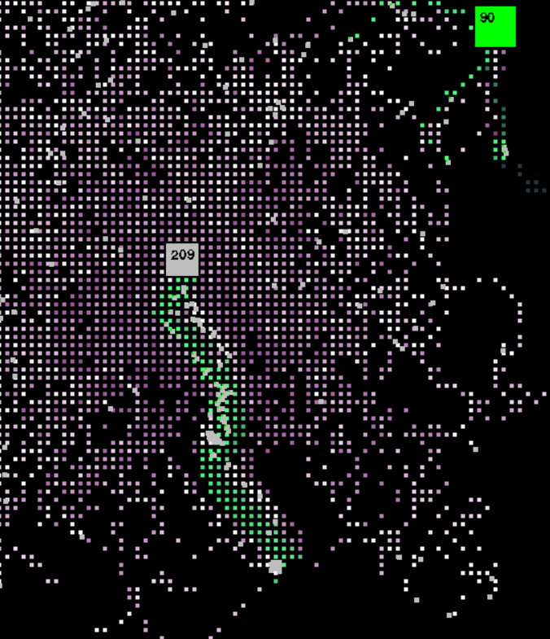

# Ant Game
My attempt at making a simulation of ants in ```pygame```. 

The idea is taken from [this video](https://www.youtube.com/watch?v=81GQNPJip2Y&t=2s&pp=ygUOYW50IHNpbXVsYXRpb24%3D).

## Mechanics
Basically, ants spawn at their nest and walk around randomly. They leave behind feromeones which 
indicated that they are looking for food. When they find food, they trace the feromones back to the nest. 
During their way home, they leave behin feromones indicating the way to the food. This makes other ants find the food. 
This way a really nice pattern emerges (especially when visualized using colors).

## What it looks like

